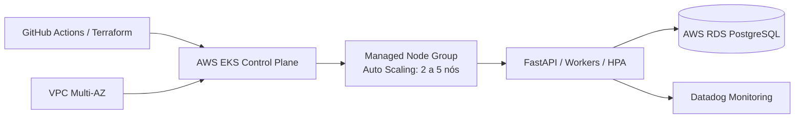

# Oficina Mecânica | Infraestrutura Kubernetes (AWS EKS)

Infraestrutura Terraform responsável pelo cluster gerenciado **AWS EKS** e pelo **Managed Node Group escalável** para a aplicação Oficina Mecânica.

## Visão Geral

| Item | Informação |
| --- | --- |
| Responsabilidade | Cluster EKS, VPC dedicada, Subnets multi-AZ, IAM Roles e Node Auto Scaling |
| IaC | Terraform |
| Plataforma | AWS EKS (Kubernetes 1.30) |
| Ambientes | `homologacao` e `production` |
| Pipeline | [GitHub Actions](.github/workflows/ci-cd.yml) |
| Estado operacional | Operacional quando o Control Plane estiver `ACTIVE` e os Nodes `Ready` |

## Arquitetura Geral



## Stack e Componentes

- Terraform >= 1.5.0
- Provider `hashicorp/aws ~> 5.0`
- VPC dedicada com DNS support/hostnames e Internet Gateway (`aws_vpc`, `aws_subnet`)
- AWS EKS Control Plane v1.30 (`aws_eks_cluster`)
- EKS Managed Node Group (`aws_eks_node_group`) com instâncias `t3.medium`
- **Cluster Auto Scaling**: Mínimo de 2 nós, Máximo de 5 nós, Desejado de 2 nós
- IAM Roles completas para cluster e nós (`AmazonEKSClusterPolicy`, `AmazonEKSWorkerNodePolicy`, etc.)

## Deploy e Acesso

### Deploy Automatizado

O pipeline de CI/CD executa `terraform fmt`, `terraform validate` e `terraform plan` em Pull Requests, e `terraform apply` automático nas branches de `homologacao` e `production`.

### Deploy Manual

```bash
cp terraform.tfvars.example terraform.tfvars
terraform init
terraform plan
terraform apply
```

### Configurar Acesso com kubectl

Após o provisionamento, configure o contexto local do Kubernetes com o comando fornecido no output do Terraform:

```bash
aws eks update-kubeconfig --region us-east-1 --name oficina-mecanica-eks
kubectl get nodes
```

## Escalabilidade

O cluster conta com duas camadas de escalabilidade:
1. **Nível de Pods (HPA):** O Horizontal Pod Autoscaler (`api-hpa.yaml`) no repositório `app-k8s` escala as réplicas da aplicação de 2 a 10 pods com base em CPU e Memória.
2. **Nível de Infraestrutura/Nós (Auto Scaling Group):** O EKS Managed Node Group expande automaticamente os nós EC2 de 2 até 5 instâncias conforme a demanda do cluster.

## Documentação Arquitetural Completa

Para detalhes sobre a topologia de rede, diagrama de sequência, decisões técnicas (RFCs/ADRs) e modelo de dados, consulte o documento consolidado:
👉 [`docs/arquitetura.md` no repositório app-k8s](../PosTechFiap_Mecanica_app-k8s/docs/arquitetura.md).
