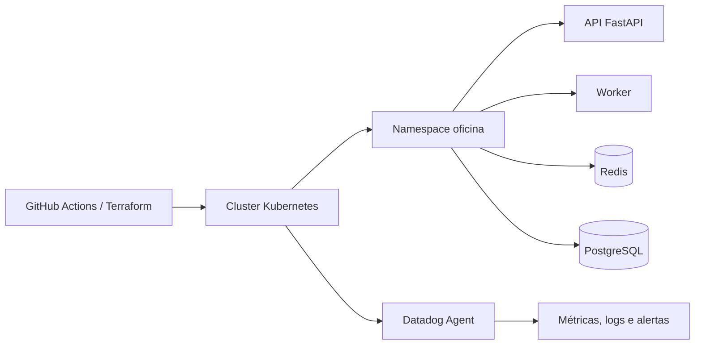

# Oficina Mecânica | Infraestrutura Kubernetes

Infraestrutura Terraform responsável pelo cluster e pelos recursos base usados pela aplicação Oficina Mecânica.

## Visão geral

| Item | Informação |
| --- | --- |
| Responsabilidade | Cluster, namespace, rede e recursos base |
| IaC | Terraform |
| Plataforma | AWS ou kind, conforme configuração |
| Ambientes | `homologacao` e `production` |
| Pipeline | [GitHub Actions](.github/workflows/ci-cd.yml) |
| Estado operacional | Operacional quando o cluster está acessível e os nodes estão `Ready` |

## Arquitetura geral



## Stack e componentes

- Terraform 1.8.5
- Kubernetes
- AWS ou kind
- GitHub Actions
- Datadog Agent/Cluster Agent

## Status operacional e endpoints

| Verificação | Acesso |
| --- | --- |
| Nodes | `kubectl get nodes` |
| Pods da aplicação | `kubectl get pods -n oficina` |
| Services | `kubectl get svc -n oficina` |
| Swagger da API | http://localhost:8000/docs após port-forward |
| Health da API | http://localhost:8000/health após port-forward |
| Endpoint público | Depende do NodePort, LoadBalancer ou Ingress do ambiente |

Este repositório provisiona a plataforma; a API e seu Swagger são mantidos no repositório [PosTechFiap_Mecanica_app-k8s](../PosTechFiap_Mecanica_app-k8s/README.md).

## Deploy e acesso

### Deploy automatizado

O [pipeline de CI/CD](.github/workflows/ci-cd.yml) executa `fmt`, `validate`, `plan` e `apply` por ambiente. O endpoint final depende dos outputs e da exposição configurada no cluster.

### Deploy manual

```bash
cp terraform.tfvars.example terraform.tfvars
terraform init
terraform plan
terraform apply
terraform output
```

### Acesso ao cluster e à API

```bash
kubectl get nodes
kubectl get pods -A
kubectl get svc -n oficina
kubectl port-forward svc/api 8000:8000 -n oficina
```

Depois do port-forward:

- Swagger: http://localhost:8000/docs
- Health: http://localhost:8000/health

Se o Service estiver publicado como NodePort, use `http://<IP-do-node>:30000/docs`; se estiver atrás de LoadBalancer/Ingress, use o hostname fornecido pelo ambiente.

## CI/CD e configuração

Secrets esperados: `AWS_ACCESS_KEY_ID`, `AWS_SECRET_ACCESS_KEY` e `AWS_REGION`. Valores sensíveis permanecem fora do Git e devem ser fornecidos por variáveis protegidas.

## Observabilidade

O cluster deve coletar CPU, memória, latência, probes, reinícios, logs JSON e falhas de processamento. O Datadog Agent deve ser instalado no namespace de monitoramento com `DATADOG_API_KEY` e `DATADOG_APP_KEY` protegidos.

## Estrutura do repositório

```text
cluster.tf             Cluster e recursos base
providers.tf           Providers Terraform
variables.tf           Variáveis de ambiente
outputs.tf             Endpoints e saídas
.github/workflows/     Pipeline de validação e deploy
```

## Segurança e governança

- kubeconfig e credenciais fora do Git;
- produção sujeita a aprovação e checks;
- namespace e permissões devem seguir menor privilégio;
- merge somente via Pull Request em branch protegida.
